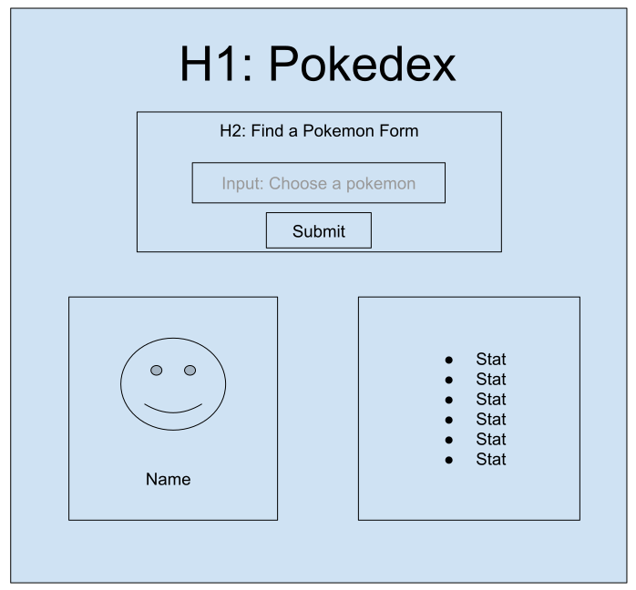

# Pokedex

## Setup
`npm create vite`
- name: pokedex
- Vanilla
- JavaScript

cd into pokedex and `npm i`

## Plan

draw a wireframe



plan out the logic:
* When the page loads:
  * fetch pikachu (make sure to catch any errors)
  * render pikachu data to the screen
  * add an event listener for the form

* When the form is submitted:
  * grab data from the form
  * use that data to fetch a new pokemon (make sure to catch any errors)
  * render that pokemon to the screen

## HTML

Within the `body` of our `index.html` file, we'll provide the structure for our application's front end

```html
<div id="app">
  <h1>Pokedex</h1>
  <form aria-label="pokemon search form" id="pokemon-search-form">
    <h2>Find a Pokemon</h2>
    <label for="pokemon"></label>
    <input type="text" name="pokemon" id="pokemon-input" />
    <button type="submit">Submit</button>
  </form>
  <section id="pokemon-display">
    <div id="pokemon-picture">
      
      <p></p>
    </div>
    <div id="pokemon-stats">
      <ul></ul>
    </div>
  </section>
</div>
```

## JavaScript

First, render pikachua data when the page loads. Here we use a helper function that can fetch and render any pokemon. The flexibility of this generic helper function will be useful for the search functionality.

```js
const getPokemonData = (pokemonName) => {
  const promise = fetch(`https://pokeapi.co/api/v2/pokemon/${pokemonName}`);
  promise
    .then((response) => response.json())
    .then((data) => {
      console.log(data);
      // render the data
      const img = document.querySelector("#pokemon-picture>img")
      const p = document.querySelector("#pokemon-picture>p")
      img.src = data.sprites.front_default;
      p.textContent = data.name
    })
    .catch((error) => console.error(error.message));
}

const main = () => {
  getPokemonData("pikachu");
}

main(); // running when the page loads
```

Next, we implement the form search such that it can also fetch pokemon data. Make sure to use the `getPokemonData` helper from the last step!

```js
const searchForPokemon = (e) => {
  // stop the reload/redirect
  e.preventDefault();

  const form = e.target;
  const formData = new FormData(form);
  const formObj = Object.fromEntries(formData);

  console.log('here is your data:', formObj);

  // use the helper function, passing in the form's pokemon data
  getPokemonData(formObj.pokemon)

  form.reset();
}

const main = () => {
  getPokemonData("pikachu");

  // add a submit event listener to the form
  const form = document.querySelector("#pokemon-search-form")
  form.addEventListener('submit', searchForPokemon)
}
```